# Ansible_project
Repository for a ansible project. The meaning of the project is to automatize creating and controlling unlimited amount of computers with the following tools:
- Terraform: Making x amount of cloud computers from a chosen service. For this project we've chosen Upcloud. The terraform template used in this project was taken from one of their example [files](https://github.com/UpCloudLtd/upcloud-ansible-collection/blob/main/examples/inventory-rolling-update/resources/main.tf) 
- Ansible: Automate configuring/controlling the chosen computers made with Terraform. You can also only use the  Ansible part for existing computer(s).

Imagine doing this in just a couple minutes! 

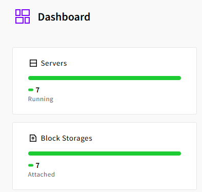

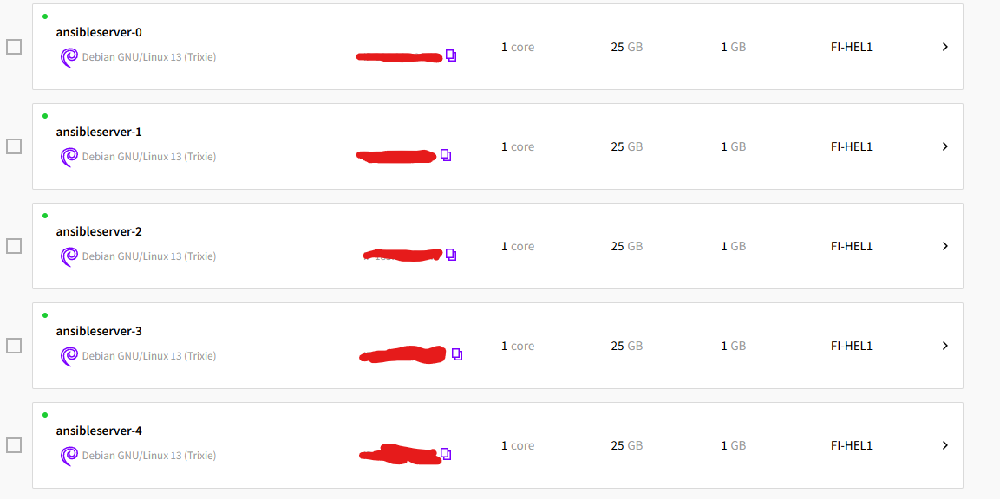

## What is inside this repo?
- install_initial.sh a shell script which installs the prequisites for running terraform and ansible. It runs the following:
	- Installs python3 pip and ansible from apt
	- Installs upcloud api from pip3 (without venv)
	- Installs other dependencies, gnupg, coreutils which are for terraform
	- And curl+ssh for ssh into the computers
	- And then it installs the dependencies for installing terraform, the bash commands are directly from hashicorps site https://developer.hashicorp.com/terraform/tutorials/aws-get-started/install-cli 
	- And finally it installs terraform

- Ansible folder
	- All you have to do to control the computers you already have or just made with terraform you just need to insert their ip's to hosts.ini

## How to run and use?
If you already have computers to controll you can skip this first part
### Terraform
1. Clone this repository or use wget 
2. Just simply run  ``bash install_initial.sh`` or install the dependencies by hand. When it's installing the ssh you'll have to press enter a couple times to continue the installation.
3. After the script has run you should see the following print in console. If you don't see it or you have installed by hand just run ``terraform -version``.

	--- Installation Complete! ---
	Terraform v1.15.1
	on linux_amd64

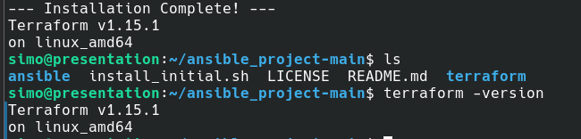

4. Edit the `terraform/main.tf` file to your preferences. Probably you want to change the `resource` part to configure the plan (meaning how much compute power) to your liking. Also the `template` part to your wanted OS and it's size. 

	-	

5. Export API token from Upcloud `export UPCLOUD_TOKEN="ucat_..."`
   	-	You can get the API token from Upcloud --> People --> (Your user) --> API Tokens --> Add new Api token
   	  
   	-	

6. Go to the ``terraform/ ``folder and run terraform init
   
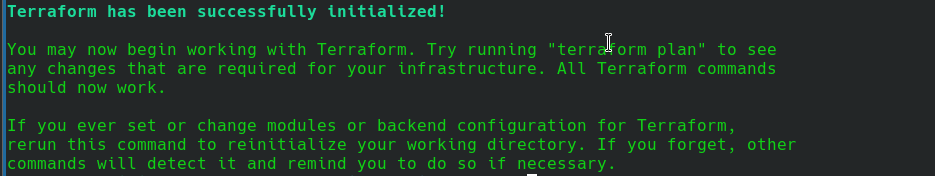

7. Run terraform apply. It should ask you to type yes to confirm you want to run the script. At this point you can check what it's making. 

If you forgot to add the API key, it'll give you a error like this

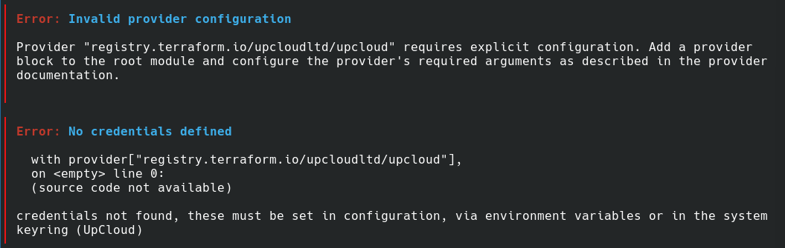

When you have the API key correct, type yes and enter

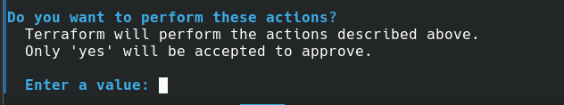

8.  Once it's finished it will type out the ip's of the generated computers.

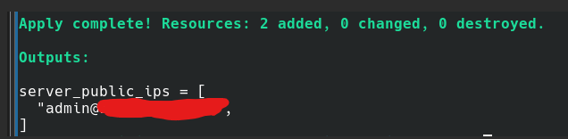

And here is how it will look in upcloud  server tab

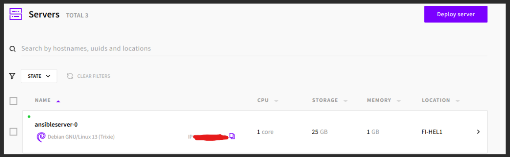

### Ansible

1. Put the ip's and the users of the computers you want to control and ssh to `ansible/hosts.ini`. By default when making a computer in upcloud, it doesn't make any other users so only root is available. The terraform script makes an admin account so that's who we're connecting to while ssh'ing. Meaning it is admin@ip

	-  

2. At this point, you will also need to put the PUBLIC ssh key of the computer you are running this from. The public key can be found from the `.ssh` folder of the user and it ends in `.pub`

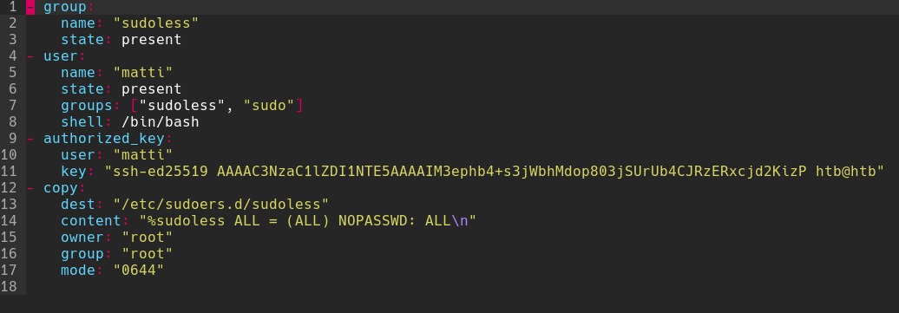

3. And now just run `ansible-playbook setup.yml`

It'll take a while and the last line of the output should look like this

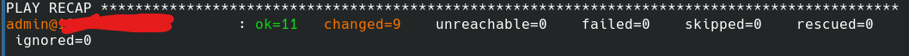

Now you can ssh into username@ip (the username from the ansible script next to ssh public key). 

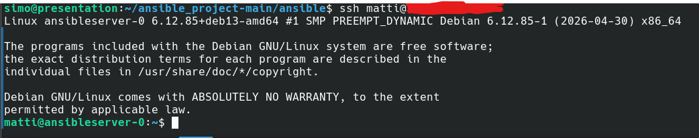

Now you can make some more automation trough ansible!

If you want to know what ansible will run (probably you do) read below.

- In roles there are
  - base_config which updates&upgrades apt and installs basic packages that you'll want the computers to have. In our script we've decided to install curl, micro, bash-completion, tree, git and wget. Feel free to change these to fit your purpose.
  - security, installs UFW which is a firewall. The it makes a rule to only allow openssh and finally it enables the ufw.
  - users which makes a group `sudoless` which allows ansible to run nicely without always prompting to type password. Then it add's a user to sudoless and sudo group and defines a shell for the user.
  - It adds a ssh key for the user so ansible can connect to it. Add your own public ssh key to it.
  - Finally it changes the sudoers.d file to make the sudoless group to actually do its purpose. 

## TLDR on what to do before running
- Modify the `terraform/main.tf` to make as many computers with the specs you want.
- Add your public ssh key to `ansible/roles/users/tasks/main.yml`. Also change the user name you want to make and also the user where the key is put
- Add the user names and ip's to `ansible/hosts.ini`. The user names are the ones defined in the `terraform/main.tf`. By default it's admin.
- Run `terraform init` and `terraform apply`. 
- Run `ansible-playbook setup.yml`

## Contributors:
[Santeri](https://github.com/Jesaka)
[Matti](https://github.com/MatPohj)

Resources used:
- https://upcloud.com/docs/guides/get-started-ansible-inventory/
- https://upcloud.com/docs/guides/rolling-update-terraform-ansible/
- https://github.com/UpCloudLtd/upcloud-ansible-collection
	- From here we've used and modifed the terraform template/examples/inventory-rolling-update/resources/main.tf https://github.com/UpCloudLtd/upcloud-ansible-collection/blob/main/examples/inventory-rolling-update/resources/main.tf
- https://developer.hashicorp.com/terraform/tutorials/aws-get-started/install-cli
- Report's from earlier homeworks
